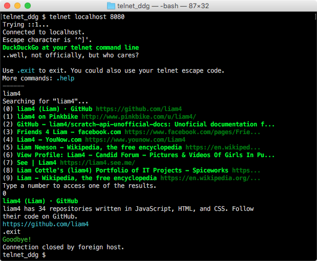

# Telnet DuckDuckGo server



Want to try it? Don't hesitate!

```bash
$ git clone https://github.com/liam4/telnet_ddg
$ npm install
$ node telnet.js # have this running in the background
```

```bash
$ telnet localhost 8080
# DuckDuckGo at your telnet command line
```
